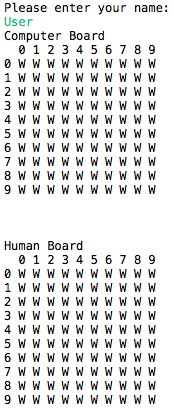
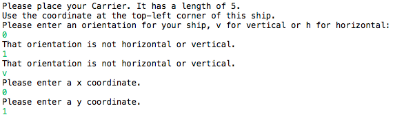
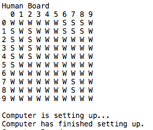

# final-project-battleshipgame
This is the final project for CIT-591.

Team member: Zohair Siraj, Jiaxu Zhou, Yu Wang

Battleship ia a strategy type guessing game. It is played on ruled grid board on which each player's fleet of ships are marked. The locations of the fleets are concealed from the other player. Players alternate turns calling "shots" at the other player's ships, and the objective of the game is to destroy the opposing player's fleet.

Five types of ship are included in this game. Each class of ship has different size. The size of Carrier is 5 and the size of Battleship is 4. The size of both Cruiser and Submarine are 3 while the size of Destroyers is 2.

Before play begins, user and computer secretly arranges their ships on their primary grid. Each ship occupies a number of consecutive squares on the grid, arranged either horizontally or vertically. The number of squares for each ship is determined by the type of the ship. The ships cannot overlap. After the ships have been positioned, players start on announcing square to hit. The first who hit all the ship locations win the game.

Source: [https://en.wikipedia.org/wiki/Battleship_(game)](https://en.wikipedia.org/wiki/Battleship_(game))


## Getting Started

After downloading, go to the directory where it is downloaded. Run the program following the instructions below.
```
cd bin
java game.Battleship
```

## How To Play
1.Type the user name

2.When the game starts, 2 of 10x10 boards will be displayed on screen.

3.Start to place your Carrier(5 size), choose vertical or horizontal, as well as start point x,y coordinate based on instructions. 'w' stands for water. 's' stands for ship. 


4.Repeat the placement for Battleship(4 sizes), Cruiser(3 size), Submarine(3 size),Destroyer(2 size)


5.After setting up, the game start by Humman player shooting first. Human player needs to choose a location to hit by inserting x, y coordinates. The result of shooting(hit or miss) will be printed out. 'x'stands for successful shooting and 'o' stands for missing.


6.The computer player will attack afterwards. Same as previous step, Attacking results will be displayed on screen. 

7.Repeat step 5 and 6 until one player hit all the ship on the broad of the other. The loser will be announced.


## Class Description

You can find detailed descriptions of classes in `doc` directory.


